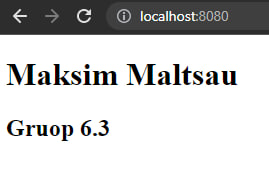

Aby uruchomić image

`docker build -t web100 .`

Na pierwszym zrzucie ekranu 

widoczne wykonanie programu

Na pierwszym zrzucie ekranu 

widoczne nazwe kontenera 

Liczba warstw w programie:
*   `sha256:b93c1bd012ab8fda60f5b4f5906bf244586e0e3292d84571d3abb56472248466`
*   `sha256:61224d4d9e66801c0ac90826694e30362ae7b9134f9fb503d49b0804dde650fa`
*   `sha256:28422cf1b343a7015b34cd924d9725e7daba1d6714a48225ff1caf414a69593b`
